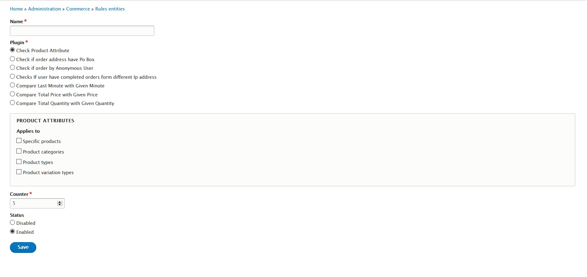
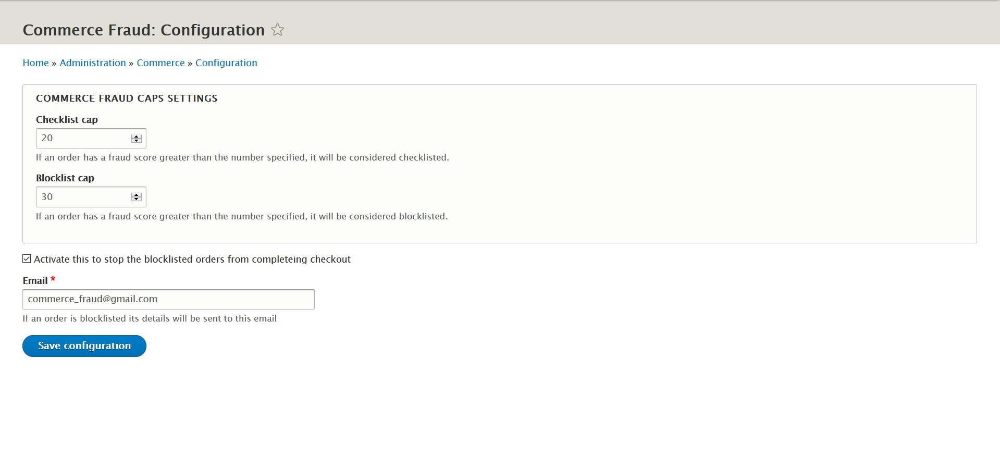

# Commerce Fraud

This module provides a framework to detect potentially fraudulent
orders and provide steps to be taken.

FEATURES
------------

  - Rules Config entity with seven default rules to keep check on orders
  - Classifing orders on the basis of fraud score calculated from rules
  - Fruad Event to be invoked in order to change fraud score of an order
  - Reset operation for commerce fraud to reset fraud score
  - Stopping fraululent orders from completing checkout
  - Sending email about the fraduluent orders
  

This module provides:

- 1 Rules config entity
- 7 Rules conditions:
    - Checks if Order by Anonymous User
    - Checks Order User IP address
    - Checks Order Last Minute
    - Checks Order Address for Po Box
    - Checks Product Attribute
    - Checks Order Total Price
    - Checks Order Total Quantity
- 1 Fraud event:
    - Increase the fraud count
    - Decrease the fraud count
    - Update the fraud count
- Adds reset operation to commerce_order
- Fraud rule logging category

The Rules actions will increase the fraud score on the provided
`commerce_order`. This counter is an integer that the "Reset the fraud
count" action sets back to 0. The "Increase the fraud count" and
"Decrease the fraud count" actions will increase or decrease this
fraud count, by default by 1. (But this is customizable.)

The "Fraud score changed" event is fired every time one of the actions
is called.

The limits used by the 3 conditions are configurable in
/admin/commerce/config/commerce_fraud. By default, they are:

- An order is whitelisted if the fraud count is < 10
- An order is blacklisted if the fraud count is >= 20
- An order is greylisted if it's between 10 and 20

INSTALLATION
------------

 * Install as you would normally install a contributed Drupal module. Visit
   https://www.drupal.org/node/1897420 for further information.
   
REQUIREMENTS
------------

  - action
  - commerce
  - entity
  - views
  - commerce:commerce_order
  - drupal:options

CONFIGURATION
-------------

The module has commerce fraud settings in Commerce configuration.

* Things that can be configured:

  - Checklist and Blocklist 
  
    These value caps are  used to classify orders
    
  - Stop order check box

    This checks wether a fraduluent order be stoped from completing checkout or not
 
  - Email
    
    This is the email used to send detail about the fraudulent orders

TROUBLESHOOTING
---------------

 * If the rule does not fire properly, check the following:

  - Does order should fire the rule enabled?
  
  - Does the log the activity properly?
   
  - Check the commerce_fraud_fraud_score for the order detail

  - Report the issue in issue queue with details of order and rule not working.

This module provides some default rules that can be turned on to start
keeping track of potentially fraudulent orders.

Developed by [Acro Media Inc][0], Sponsored by [Skilld.fr][1] and also developed by [Commerce Guys][2].

  [0]: http://www.acromediainc.com
  [1]: http://www.skilld.fr
  [2]: https://commerceguys.com
